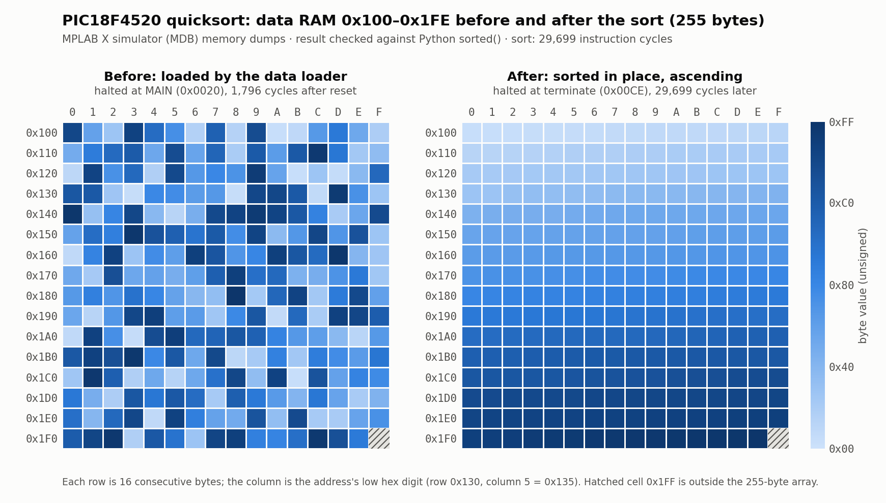

# PIC18F4520 Assembly Labs


**English** · [繁體中文](README.zh-TW.md)

Six PIC18F4520 assembly labs (MPASM) in three difficulty levels, up to an in-place iterative quicksort with a software stack. Each lab is an MPLAB X project that runs in the MPLAB simulator, so no board is needed.

| | |
|---|---|
| **Target MCU** | PIC18F4520 (8-bit, 32 KB flash, 1.5 KB RAM) |
| **Toolchain** | MPLAB X IDE v5.20 · MPASM 5.84 · `PIC18Fxxxx_DFP` 1.0.9 |

## Labs

Each lab folder has the source, a README (task, memory map, expected result) and the MPLAB X project files. Names are `MMDD_<topic>`, the month/day of the session (September 2026).

| Level | Lab | What it does | Key techniques | Result · cost |
|---|---|---|---|---|
| **Basic** | [0916 · Sum & Compare](basic/0916_sum_compare.X) | Adds two pairs of numbers, compares the sums, writes a status code | `ADDWF`, compare-and-skip (`CPFSEQ`/`CPFSGT`) three-way branch | `0x20 = 0x33` · 25 cycles |
| **Basic** | [0924 · Parity-Dependent Recurrence](basic/0924_parity_recurrence.X) | Grows a 3-term seed into 6 terms; the rule depends on whether the previous term is odd or even | banked RAM (`MOVLB`), `FSR0`/`FSR1` indirect addressing, `BTFSC`, `DCFSNZ` | `64 50 29 27 02 52` · 55 cycles |
| **Advanced** | [0916 · Bit-Palindrome Check](advanced/0916_bit_palindrome.X) | Reverses the bits of a byte with rotates and checks if it equals the original | `BTFSS`, `RLNCF`/`RRNCF`, counted loop | `0x10 = 0x0D`, flag `0x00` · 111 cycles |
| **Advanced** | [0924 · Merge Two Sorted Sequences](advanced/0924_merge_sorted.X) | Merges two ascending sequences (6 + 5 bytes) into one descending sequence | three FSRs at once, `POSTINC`, `MOVFF`, two-pointer merge | `FD B4 95 … 10 0F` · 288 cycles |
| **Hard** | [0916 · Longest Run of 1s](hard/0916_longest_ones_run.X) | Finds the longest run of consecutive `1` bits in a byte | bit-serial scan, running maximum, nested branches | `0xFF → 8` · 117 cycles |
| **Hard** | [0924 · In-Place Quicksort](hard/0924_quicksort.X) | Sorts 255 bytes in place, recursion replaced by an explicit stack in RAM | software stack on `FSR2`, 16-bit pointer carry, three FSRs | sorted ascending · 31,495 cycles |

*Cost = instruction cycles from reset to the final halt loop in the MPLAB X simulator, for the input checked into the repo.*

## Quicksort on an 8-bit core

[hard/0924](hard/0924_quicksort.X) avoids recursion, since the PIC18 hardware call stack is 31 levels deep and holds only return addresses. Instead it keeps a stack of pending sub-ranges in data RAM, driven by `FSR2`, while `FSR0` and `FSR1` scan the array from both ends:

```
Data RAM
0x000        length of the array (0xFF)
0x001–0x004  pivot value · left bound · right bound · pivot position
0x100–0x1FE  the array — sorted in place
0x300 …      software stack of (left, right) pairs   ← FSR2
```

Sub-ranges with fewer than two elements are never pushed. 255 bytes are sorted in **31,495 cycles** (1,796 for the data loader, 29,699 for the sort), and the whole program takes **210 bytes of flash**. The dumped RAM was compared byte-for-byte against `sorted()` of the input in Python.



*Data RAM, one cell per byte (darker = larger), dumped from the MDB simulator after the data loader (left) and at the halt loop 29,699 cycles later (right). Dumps, MDB script and plot script are in [`hard/0924_quicksort.X/figures/`](hard/0924_quicksort.X/figures).*

## Build and run

Requires MPLAB X IDE (developed with v5.20 on Linux) with MPASM. No programmer or board.

1. `git clone https://github.com/Adam010341/PIC18F4520-Assembly-Labs.git`
2. In MPLAB X, **File ▸ Open Project…** and pick a lab folder (e.g. `hard/0924_quicksort.X`).
3. Check **Project Properties**: device `PIC18F4520`, tool `Simulator`, toolchain `MPASM`.
4. **Debug Main Project**. Every program ends in a `GOTO terminate` loop; pause there.
5. Open **Window ▸ Target Memory Views ▸ File Registers** and look at the addresses in the lab's README.

Every source except `hard/0924_quicksort.X/hard_924.asm` sets `CONFIG OSC = INTIO67` and `CONFIG WDT = OFF`. The quicksort source has no `CONFIG` lines and uses the device's default configuration bits.

## Layout

```
.
├── basic/
│   ├── 0916_sum_compare.X/
│   └── 0924_parity_recurrence.X/
├── advanced/
│   ├── 0916_bit_palindrome.X/        # + earlier_attempt/ (first version)
│   └── 0924_merge_sorted.X/
├── hard/
│   ├── 0916_longest_ones_run.X/
│   └── 0924_quicksort.X/             # + figures/ (RAM heatmap, MDB dumps, plot script)
├── README.md
└── README.zh-TW.md
```

Each `*.X` folder holds the `.asm` source, a lab `README.md`, the `Makefile` and `nbproject/`.

## Verification

Each lab was assembled with MPASM through its Makefile and run in MPLAB's command-line simulator (MDB). The data RAM at the halt loop was dumped and compared with values computed by hand or in Python. Extra inputs were checked for edge cases (bit-palindrome: `0x99`; longest run: `0x76`, `0xDD`).
