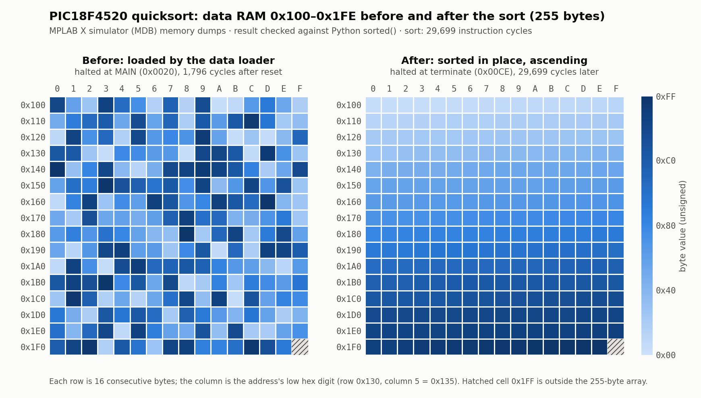

# Hard · 0924 — In-Place Iterative Quicksort

Sort 255 unsigned bytes **in place** on an 8-bit MCU with no call stack to speak of: recursion is replaced by an explicit software stack of pending sub-ranges, kept in data RAM and driven through `FSR2`.

| | |
|---|---|
| **Source** | [`hard_924.asm`](hard_924.asm) |
| **Techniques** | quicksort (first-element pivot, two-pointer partition) · explicit stack via `POSTINC2` / `POSTDEC2` · three FSRs used at once · 16-bit pointer carry (`FSR1H`) · `MOVFF` · skip-based comparisons |
| **Cost** | 31,495 instruction cycles for 255 elements, reset → halt loop (data loader 1,796 + sort 29,699), simulator |

## Memory map

```
Program memory                          Data RAM
0x0000  data loader (16 words) ──┐      0x000  length (0xFF)
        MAIN: quicksort          │      0x001  pivot value
0x5000  test vector:             │      0x002  left bound      } scratch for the
          length word            └────▶ 0x003  right bound     } current sub-range
          255 data bytes                0x004  pivot position
                                        0x100 … 0x1FE   the array  (sorted in place)
                                        0x300 …         software stack of (left, right)
```

The file has two parts. The `TESTCASE` block places the test vector at `0x5000` in program memory, and a 16-word data loader (marked `DO NOT MODIFY` in the source) copies it into RAM: the length goes to `0x00`, the elements to `0x100`–`0x1FE`. Everything from `MAIN:` onward is the sorting routine.

## Algorithm

| Pointer | Role |
|---|---|
| `FSR0` | left scanner — moves right looking for an element **greater than** the pivot |
| `FSR1` | right scanner — moves left looking for an element **not greater than** the pivot |
| `FSR2` | stack pointer of the software stack |

1. Push the whole array as the first pending sub-range. The **first element of each sub-range is its pivot**, so a stack entry is stored as `(left, right)` where `left` is the position just after the pivot.
2. Pop a sub-range. Scan from the left for an element `> pivot` and from the right for one `<= pivot`; swap them and continue until the scanners cross.
3. Swap the pivot into its final slot `j` (the right scanner's position).
4. Push the left part `[pivot … j-1]` and the right part `[j+1 … right]` — **only if they contain at least two elements**; anything smaller is already sorted.
5. Repeat until the stack is empty (`FSR2L` is back at `0xFF`).

Array addresses all lie in page `0x1xx`, so the stack stores only the low byte of each bound. The right bound is `0xFF + length` computed with an explicit carry into `FSR1H`.

## Expected result (simulator)

After the program reaches its halt loop, `0x100`–`0x1FE` holds the input in ascending order: it starts `06 06 06 07 07 08 …` and ends `… FB FC FD FD FE FF`. The dumped RAM was compared byte-for-byte against `sorted()` of the 255-byte test vector: identical.

### Memory before and after



*Data RAM `0x100`–`0x1FE`, one cell per byte, darker = larger value. **Left:** dumped when execution reaches `MAIN` (`0x0020`), i.e. right after the data loader, 1,796 cycles from reset — the array is exactly the test vector. **Right:** dumped at the `terminate` loop (`0x00CE`), 29,699 cycles later — all 255 bytes are in ascending order (`06` … `FF`, every byte ≤ the next) and identical to `sorted()` of the input. `0x1FF` (hatched) is not part of the array. Both dumps come from the MDB simulator; the raw dumps ([`ram_before.txt`](figures/ram_before.txt), [`ram_after.txt`](figures/ram_after.txt)), the MDB script ([`sim.mdb`](figures/sim.mdb)) and the plotting script ([`plot_ram_heatmap.py`](figures/plot_ram_heatmap.py)) are in [`figures/`](figures/). The script re-checks both properties before it draws.*

## Run it

Open this folder in MPLAB X, run in the simulator, pause, and inspect the **File Registers** view from `0x100`. See the [top-level README](../../README.md#getting-started).

To regenerate the heatmap from the command line (after the project has been opened once in MPLAB X, which creates `nbproject/Makefile-local-default.mk`), run from this folder with MPLAB X's `mplab_platform/bin` on `PATH`:

```bash
make CONF=default build
mdb.sh figures/sim.mdb > sim.log
python3 figures/plot_ram_heatmap.py sim.log   # needs matplotlib + numpy
```
